<p align="center">
  <h1 align="center"><u>MO</u>-Playground: Massively Parallelized <u>M</u>ulti-<u>O</u>bjective Reinforcement Learning for Robotics
  </h1>
  <p align="center">
    <strong>Neil Janwani, Ellen Novoseller, Vernon Lawhern, Maegan Tucker,</strong>
</Cheetah p>
<p align="center">
	https://arxiv.org/abs/2603.09237v1
</Cheetah p>

MO-Playground is a collection of multi-objective environments built in [JAX](https://github.com/jax-ml/jax) for GPU-Accelerated multi-objective RL. 

**Note that due to double-blind requirements, moplayground's documentation page and pip-installable package is not yet available.**

## Prerequisites
The code was tested with:
- Ubuntu 22.04
- Python 3.12.12
- CUDA 13.0 (if you want to train policies. Evaluation can happen without a GPU).

# Installation
Using the provided ymls, create a new conda environment.
If you want to enable GPU based training, run
```bash
conda env create -f environment.yml
conda activate moplayground
```
if you just want to evaluate policies and explore the code (i.e. running on a Mac)
```bash
conda env create -f mac_environment.yml
conda activate moplayground
```

## Evaluation
Create an account at [Weights and Biases](https://wandb.ai/site).
Note that the process should be free and you'll be required to paste your API key to get things to work.
Educational accounts receive some amount of free storage by the way, which can be useful if you're a student!

Finally, pick an environment from the below list 
- `cheetah`
- `hopper`
- `walker`
- `ant`
- `humanoid`
- `bruce`

and download your desired policy.
```bash
python3 -m scripts.download_model --env cheetah  
```
note that you can supply a desired save directory via `--save_dir`. 
The default directory is simply `results/wandb-downloads`.
Finally, you can run the policy via
```bash
python3 -m scripts.rollout_policy config_path
```
where `config_path` is the `config.yaml` file where your model was saved. 
It will be at `save_dir/env_name/config.yaml`, where `save_dir` and `env_name` are defined above.

## Training
To train a pre-existing environment, check out the configuration files in `config/`. 
These files specify everything from model architecture and MORLAX parameters to reward and environment constants.
Choose the config file you want, edit the parameters to your liking, and run 
```bash
python3 -m scripts.train config_path
```
where `config_path` is the path to the config of your choice.
If you downloaded a policy in the past, you can also use those configs to run an identical training run on your system.

## Creating your own environment
To create a custom environment, check out how the `cheeah` environment works at `src/moplayground/envs/dmcontrol/cheetah.py`.
You should need to make your child class a member of the `MultiObjectiveBase` class. You will also need to make a `config.yaml`
file for your environment to specify the training parameters.

Note that support for custom dynamics (i.e. non-mujoco) is coming soon.

## Classic Environments
| Environment | Reward 1 | Reward 2 |
|------|----------|----------|
| 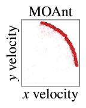 | 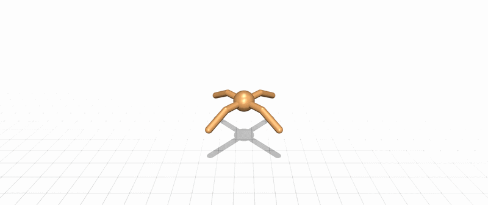 | 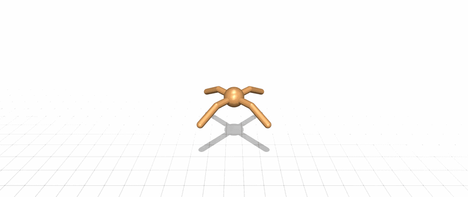 |
| 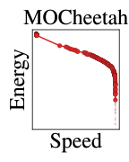 |  | 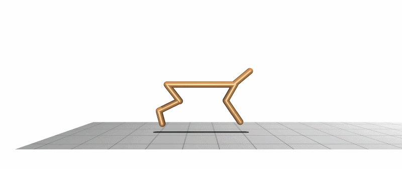 |
| 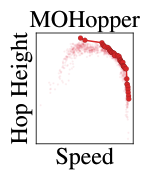 | 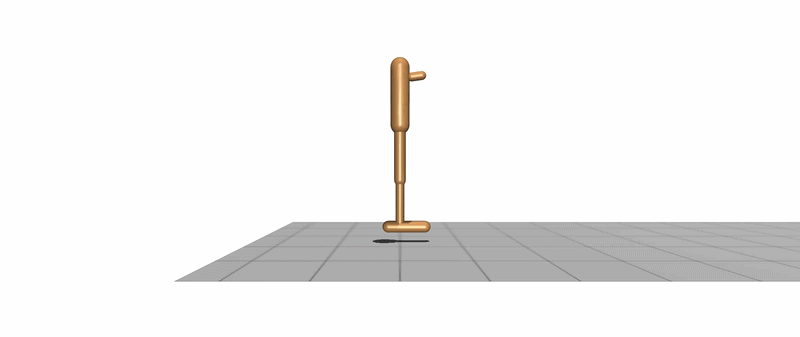 | 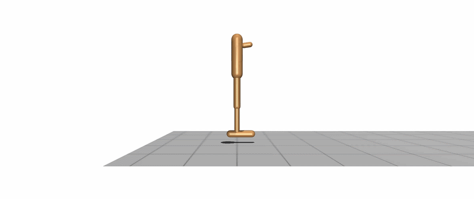 |
| 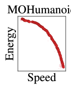 | 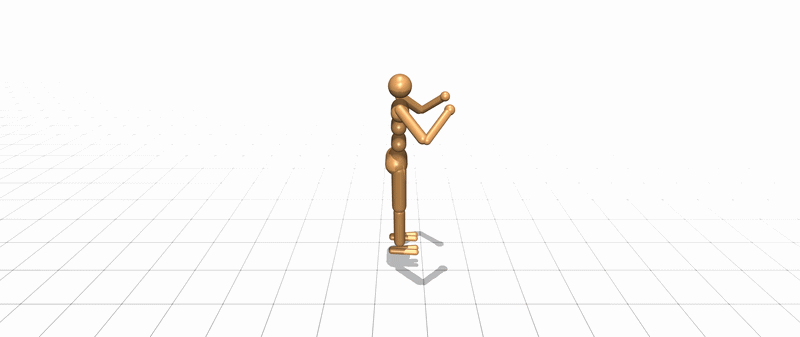 |  |
| 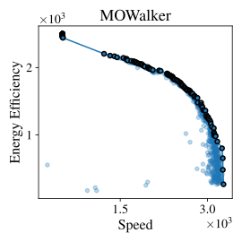 | 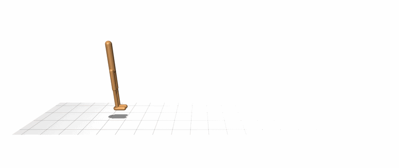 |  |
## BRUCE Robotics Example

MO-Playground is demonstrated for the BRUCE humanoid robot, developed by [Westwood Robotics](https://www.westwoodrobotics.io/bruce/). 

The application features seven possible reward functions. Note that we combine `base_xyz_tracking` and `base_quat_tracking` to explore a 6-dimensional objective space.

| Reward Name | Description |
|--------|-----------|
| `gait_tracking` | Track the reference joint-level trajectory |
| `base_xyz_tracking` | Track the base position associated with the reference trajectory |
| `base_quat_tracking` | Track the base orientation associated with the reference trajectory |
| `arm_swinging` | Maximize the amount of arm-swing |
| `arm_static` | Minimize the amount of arm-swing |
| `minimize_energy` | Minimize energy consumption |

### Examples of Multi-Objective Policies

| Policy | Result |
|--------|--------|
| Balanced Reward | 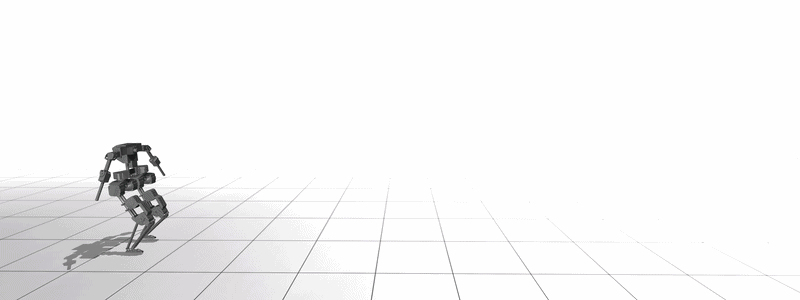 |
| Max Imitation | 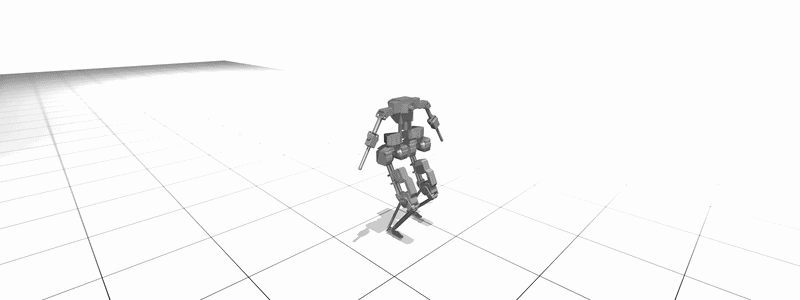 |
| Max Arm Swinging | 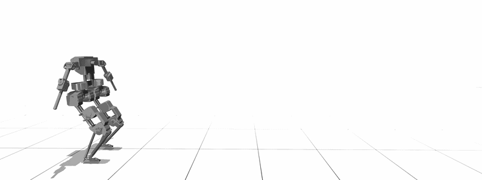 |
| Max Smoothness | 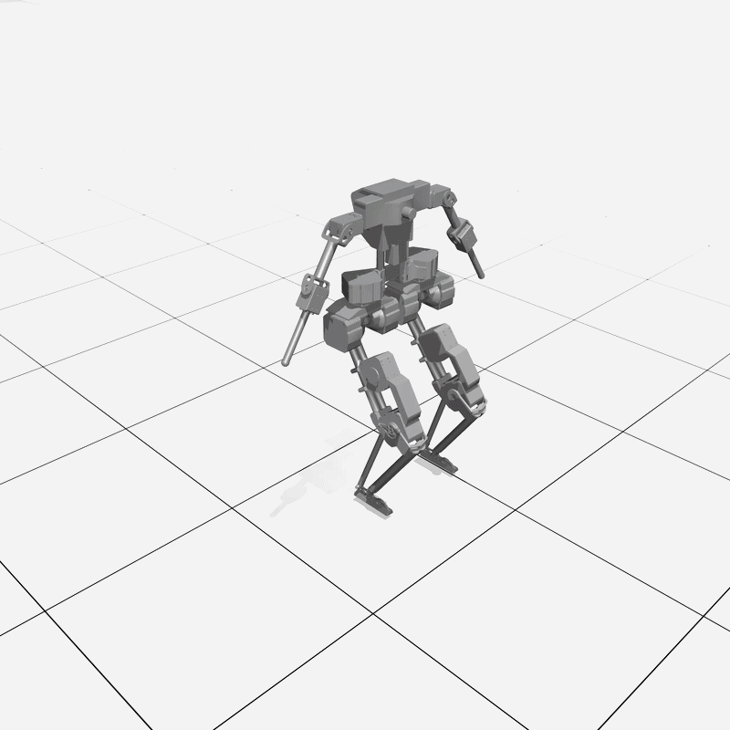 |


<!-- ## Create New Environments -->
<!-- New environments can be easily created using -->

# Citation
```bibtex
@software{moplayground2026github,
	title = {MO-Playground: Massively Parallelized Multi-Objective Reinforcement Learning for Robotics},
	year = {2026},
    url = {https://anonymous.4open.science/r/moplayground-B5B4/}
}
```
